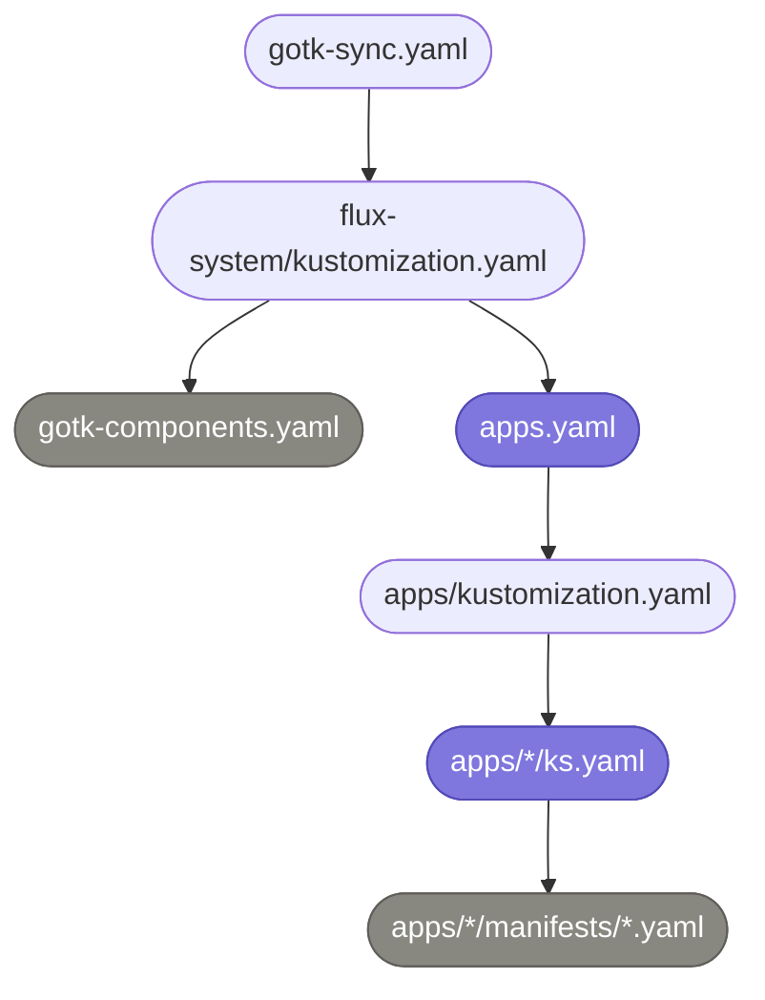

# Flux Reconciliation Tree

`flux bootstrap` points the `flux-system` Kustomization at this directory.
Everything below it is discovered from git.

Each app directory is self-contained: its `ks.yaml` is a Flux Kustomization
with `targetNamespace` set, and `manifests/` holds the Namespace, any
HelmRepository and HelmRelease, and the app's own objects. There is no shared
sources directory; chart repositories are declared next to the release that
uses them.

Ordering that matters is expressed with `dependsOn`
(`cert-manager-issuers` waits for `cert-manager`) and `wait: true` on the
Kustomizations that install CRDs (`cert-manager`, `envoy-gateway`).
