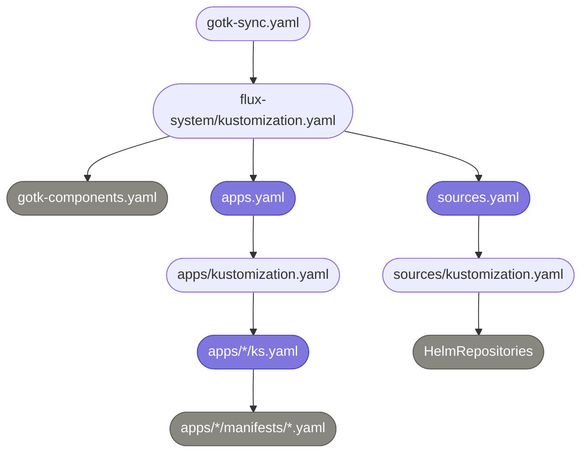

# Flux Reconciliation Tree

```mermaid
graph TD
    A([gotk-sync.yaml]) --> B([flux-system/kustomization.yaml])
    B --> C([gotk-components.yaml]):::note
    B --> D([apps.yaml]):::ks
    B --> E([sources.yaml]):::ks
    D --> F([apps/kustomization.yaml])
    F --> G([apps/*/ks.yaml]):::ks
    G --> H([apps/*/manifests/*.yaml]):::note
    E --> I([sources/kustomization.yaml])
    I --> J([HelmRepositories]):::note

    classDef ks fill:#7F77DD,stroke:#534AB7,color:#fff
    classDef note fill:#888780,stroke:#5F5E5A,color:#fff
```
